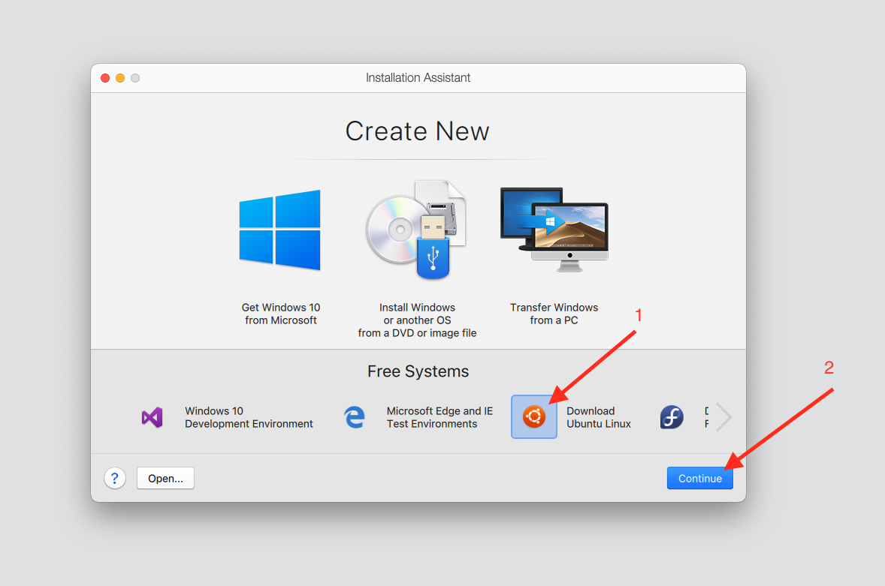
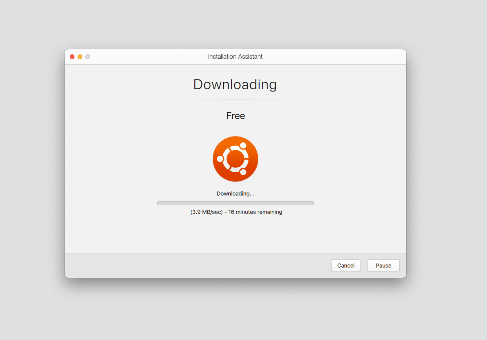
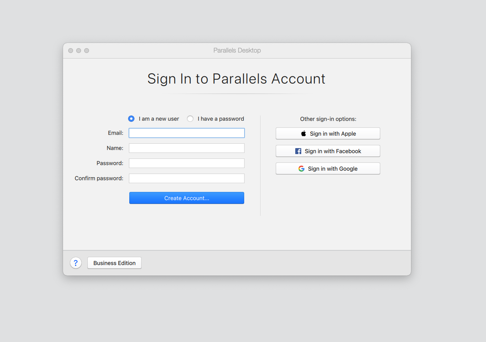
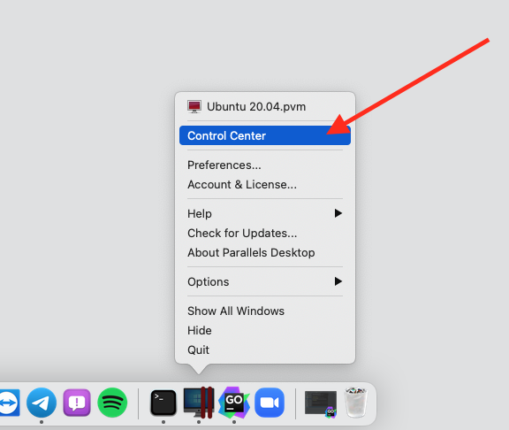
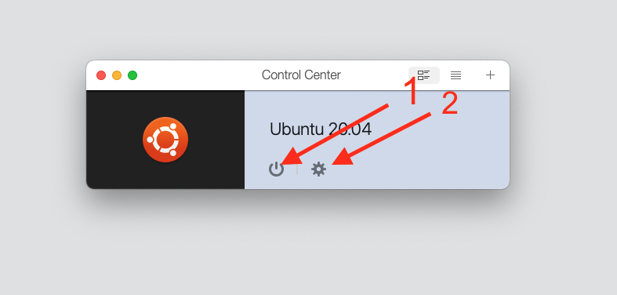
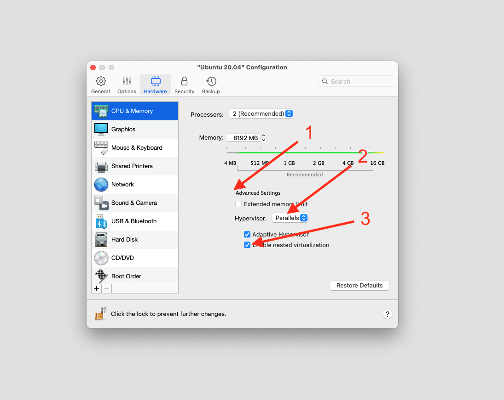
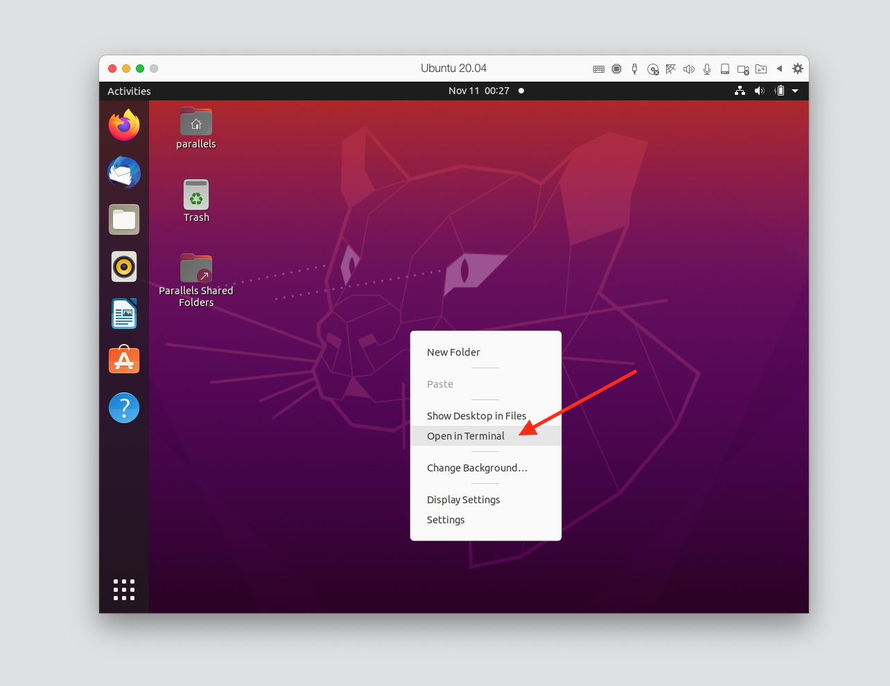
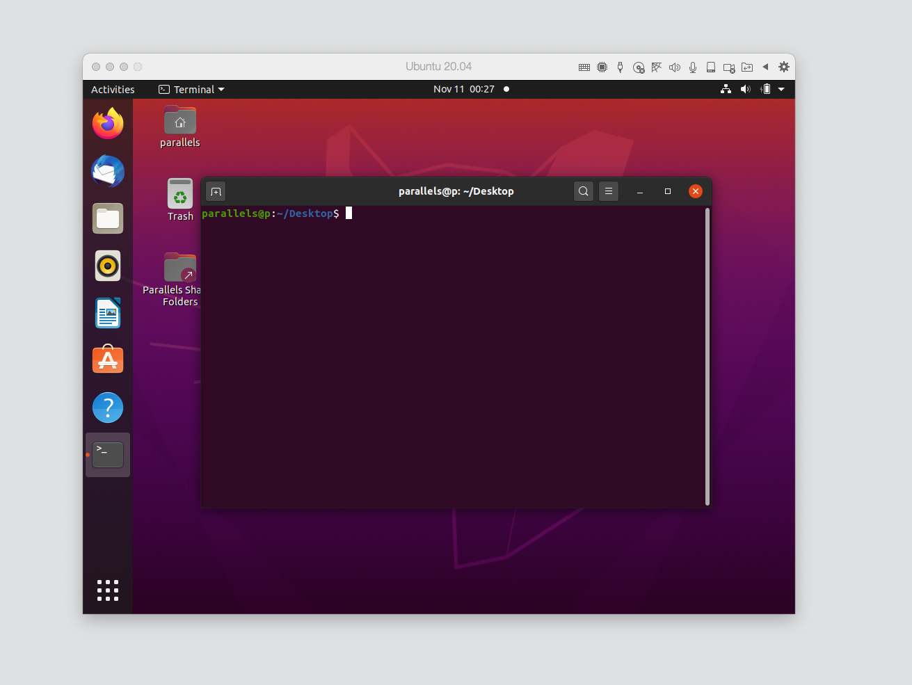

# Parallels Quick Start

In order to launch an EVE instance, Eden, containers-in-VMs, VMs on MacOS you may be using Parallels 
virtualization software.

We will need Parallels Desktop Pro Edition. https://www.parallels.com/products/desktop/pro/
Parallels Desktop Pro Edition has a trial period to test it out. 
Advanced features available only in ***Pro version*** and supports MacOS Big Sur. 

### Installation

1) Install Parallels Desktop Pro Edition from official website
2) Download the Parallels Desktop installer to your Mac.
3) Double-click the .dmg installation file to mount it in Finder, then double-click Install.
4) Read through the Software License Agreement and click Accept.
5) Once prompted, enter your local Mac user password to finalize the installation.

First screen will offer you different VM installation options. 

1) Choose Download Ubuntu Linux
2) Click continue
Installation takes several minutes, and it depends on hardware and network bandwidth.

Once you start a VM in Parallels Desktop Pro for Mac for the first time, it will prompt you to create 
or sign in. If we don't have Parallels account, select the option I am a new user and click Create Account, 
then follow the instructions.

After log in you will need to stop VM and make the VM config changes.

Go to the Dock and open Control Center of VMs. Here you will see only one Ubuntu VM and click power button(1).
After that VM will be turned off.

1) Turn Off 
2) Open VM configurations

### Netsed Virtualizaiton Feature

Now when VM is off we need to change configuration and turn on nested virtualization feature.
This configuration is critical if we want to continue developing process on MacOS.
Advanced features available only in ***Pro version*** and supports MacOS Big Sur. 

1) Click Advanced Settings
2) Set Hypervisor type to **Parallels**.
3) Click the **Enable Nested Virtualization** checkbox.

Now turn on a virtual machine and open terminal.

Now VM is ready for later configurations as usual Ubuntu system.
