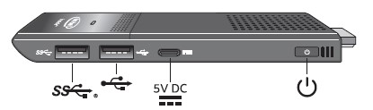
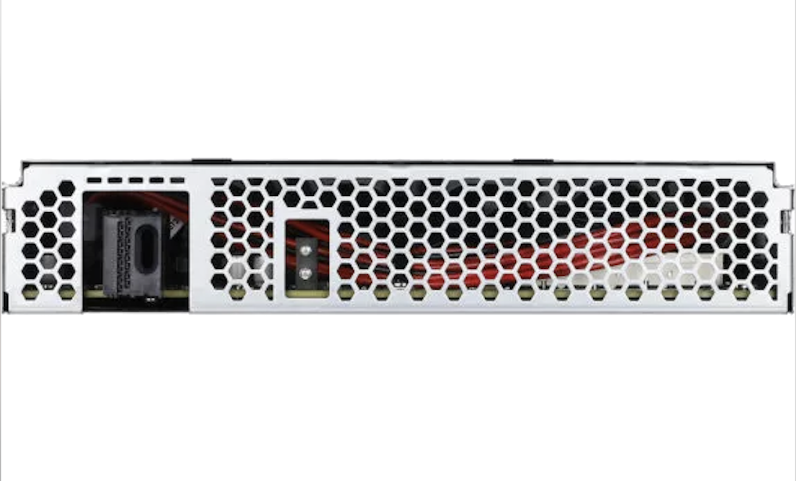
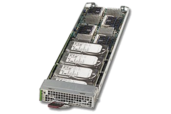

# Community supported hardware models
<!-- markdownlint-disable MD033 -->

## x86 models

### [Advantech](https://www.advantech.com)

* [ARK 1124](template_l1_ARK-1124.json) - [Vendor site](null)  
* [EIS D150](template_l1_EIS-D150.json) - [Vendor site](null)  
* [EIS D210](template_l1_EIS-D210.json) - [Vendor site](null)  
* [FWA 1012VC](template_l1_FWA-1012VC.json) - [Vendor site](null)  
* [FWA T011](template_l1_FWA-T011.json) - [Vendor site](null)  
* [UNO 2372G](template_l1_UNO-2372G.json) - [Vendor site](https://www.advantech.com/products/1-2mlj9a/uno-2372g/mod_f4ff5680-f016-44bd-bff0-e5eddfd82237)  
* [UNO 420](template_l1_UNO-420.json) - [Vendor site](https://www.advantech.com/products/9a0cc561-8fc2-4e22-969c-9df90a3952b5/uno-420/mod_2d6a546b-39e3-4bc4-bbf4-ac89e6b7667c)  
* [UTX 3117](template_l1_UTX-3117.json) - [Vendor site](null)  

### [Asem automation](https://www.asemautomation.com)

* [ASEM BM100](template_l1_ASEM-BM100.json) - [Vendor site](https://www.asemautomation.com/en/products/5/bm100.html)  

### [Dell](https://www.dell.com/en-us/work/shop/servers/cp/servers-storage-networking)

* [Edge Gateway 3001](template_l1_Dell-Edge-Gateway-3001.json) - [Vendor site](null)  
* [Edge Gateway 3002](template_l1_Edge-Gateway-3001.json) - [Vendor site](null)  

* [PowerEdge R6415 A](template_l1_Packet-c2.medium.x86.json) - [Vendor site](https://metal.equinix.com/developers/docs/servers/#c2mediumx86)  
* [PowerEdge R6515 B](template_l1_Packet-c3.medium.x86.json) - [Vendor site](https://metal.equinix.com/developers/docs/servers/#c3mediumx86)  
* [PowerEdge R6515 C](template_l1_Packet-m3.large.x86.json) - [Vendor site](https://metal.equinix.com/developers/docs/servers/#m3largex86)  
* [PowerEdge C6320](template_l1_Packet-m1.xlarge.x86.json) - [Vendor site](https://metal.equinix.com/developers/docs/servers/#m1xlargex86)  
* [PowerEdge R640 A](template_l1_Packet-m2.xlarge.x86.json) - [Vendor site](https://metal.equinix.com/developers/docs/servers/#m2xlargex86)  
* [PowerEdge R640 B](template_l1_Packet-n2.xlarge.x86.json) - [Vendor site](https://metal.equinix.com/developers/docs/servers/#n2xlargex86)  
* [PowerEdge R640 C](template_l1_Packet-x2.xlarge.x86.json) - [Vendor site](https://metal.equinix.com/developers/docs/servers/#x2xlargex86)  

### [HPE](https://buy.hpe.com/us/en/servers)

* [ProLiant DL380 Gen10](template_l1_HP_DL380.json) - [Vendor site](https://buy.hpe.com/us/en/servers/proliant-dl-servers/proliant-dl300-servers/proliant-dl380-server/hpe-proliant-dl380-gen10-server/p/1010026818)  
* [ProLiant DL360 Gen10 A](template_l1_Packet-f3.large.x86.json) - [Vendor site](HPE.ProLiant DL360 Gen10)  
* [ProLiant DL360 Gen10 B](template_l1_Packet-f3.medium.x86.json) - [Vendor site](HPE.ProLiant DL360 Gen10)  

### [iEi](https://www.ieiworld.com/tank-aiot-development-kit/en/)

* [TANK 870 Q170 QGW](template_l1_TANK-870-Q170-QGW.json) - [Vendor site](https://www.ieiworld.com/en/product/model.php?II=525)  
* [TANK 870 AI i7 8G 2A](template_l1_iEi_TANK-870-AI-i7-8G-2A.json) - [Vendor site](https://www.ieiworld.com/tank-aiot-development-kit/en/)  
* [TANK 870 AI i5 8G 2A](template_l1_iEi_TANK-870-AI-i5-8G-2A.json) - [Vendor site](https://www.ieiworld.com/tank-aiot-development-kit/en/)  

### [Intel](https://www.intel.com/content/www/us/en/products/boards-kits.html)

* [Compute Stick T6](template_l1_Intel-Stick-T6.json) - [Vendor site](https://www.intel.com/content/www/us/en/products/boards-kits/compute-stick.html)  
* [NUC10i7FNH2](template_l1_Intel_NUC10i7FNH2.json) - [Vendor site](https://ark.intel.com/content/www/us/en/ark/products/188811/intel-nuc-10-performance-kit-nuc10i7fnh.html)  

### [Kontron](https://www.kontron.com/products/systems/embedded-box-pc)

* [KBox A 150 APL](template_l1_kbox.json) - [Vendor site](https://www.kontron.com/products/systems/embedded-box-pc/kbox-a-series/kbox-a-150-apl.html)  
* [KBox B 150 APL](template_l1_kontron.json) - [Vendor site](https://www.kontron.com/products/systems/embedded-box-pc/kbox-a-series/kbox-a-150-apl.html)  

### [Lanner](http://www.lannerinc.com/products/industrial-communication-platforms/)

* [LEC 6041A](template_l1_LEC-6041A.json) - [Vendor site](http://www.lannerinc.com/products/industrial-communication-platforms/industrial-cyber-security-box-pc/lec-6041)  
* [LEC 7242](template_l1_LEC-7242.json) - [Vendor site](http://www.lannerinc.com/products/industrial-communication-platforms/industrial-cyber-security-box-pc/lec-7242)  

### [Moxa](https://www.moxa.com/en/products/industrial-edge-connectivity)

* [MOXA 1200](template_l1_MOXA-1200.json) - [Vendor site](XXXX)  

### [Nexcom](https://www.nexcom.com/Products/industrial-computing-solutions/)

* [NIFE105 A](template_l1_NEXCOM-NIFE105.json) - [Vendor site](https://www.nexcom.com/Products/industrial-computing-solutions/pc-based-factory-automation/industrial-fieldbus-computer/industrial-fieldbus-computer-nife-105)  
* [NIFE105 B](template_l1_NIFE105.json) - [Vendor site](https://www.nexcom.com/Products/industrial-computing-solutions/pc-based-factory-automation/industrial-fieldbus-computer/industrial-fieldbus-computer-nife-105)  

### [OnLogic](https://www.onlogic.com/)

* [CL210G-11-RS](template_l1_OnLogic-CL210G-11-RS.json) - [Vendor site](https://www.onlogic.com/cl210g-11-rs/)  

* [MC510-50 (CPU: G5400T, RAM: 8G, Disk: 128G M.2 SSD, TPM Enabled)](template_l1_OnLogic-MC510-50_P-G5400T_M-8G_D-128G_TPM.json) - [Vendor site](https://www.onlogic.com/mc510-50/)  

### [Open 19](https://www.open19.org)

* [ASROCK 1U](template_l1_Packet-t3.small.x86.json) - [Vendor site](https://www.open19.org/marketplace/asrock-rack-1u-open19-t3-small-x86)  

### [PC Engines](https://www.pcengines.ch/)

* [APU 2](template_l1_APU-2.json) - [Vendor site](https://pcengines.ch/apu2.htm)  

### [Rockwell automation](https://www.rockwellautomation.com)

* [VersaView 5400 TOUCH](template_l1_VersaView-5400-TOUCH.json) - [Vendor site](https://www.rockwellautomation.com/en-gb/products/hardware/allen-bradley/industrial-computers-monitors/industrial-computers/6200-versaview-5400-industrial-computer.html)  
* [VersaView 5400](template_l1_VersaView-5400.json) - [Vendor site](https://www.rockwellautomation.com/en-gb/products/hardware/allen-bradley/industrial-computers-monitors/industrial-computers/6200-versaview-5400-industrial-computer.html)  
* [VersaView 6300](template_l1_VersaView-6300.json) - [Vendor site](https://www.rockwellautomation.com/en-us/products/hardware/allen-bradley/industrial-computers-monitors/thin-clients/6300t-box-thin-client.html)  
* [Rockwell 1756](template_l1_Rockwell-1756CMS1B1.json) - [Vendor site](https://literature.rockwellautomation.com/idc/groups/literature/documents/um/1756-um003_-en-p.pdf)  

### [Siemens](https://new.siemens.com/global/en/products/automation/pc-based/iot-gateways)

* [SIMATIC IPC127E](template_l1_SIMATIC-IPC127E.json) - [Vendor site](https://new.siemens.com/global/en/products/automation/pc-based/iot-gateways/simatic-ipc127e.html)  

### [Supermicro](https://www.supermicro.com/en/products/)

* [MBI 6418A](template_l1_MBI-6418A-T7H.json) - [Vendor site](https://www.supermicro.com/en/products/MicroBlade/module/MBI-6418A-T7H.cfm)  
* [SYS 5018D FN8T](template_l1_SYS-5018D-FN8T.json) - [Vendor site](null)  
* [SYS E100 9APP wwan](template_l1_SYS-E100-9APP-wwan.json) - [Vendor site](null)  
* [SYS E100 9APP](template_l1_SYS-E100-9APP.json) - [Vendor site](null)  
* [SYS E100 9S](template_l1_SYS-E100-9S.json) - [Vendor site](null)  
* [SYS E300 8D](template_l1_SYS-E300-8D.json) - [Vendor site](null)  
* [SYS E300 9A](template_l1_SYS-E300-9A-4CN10P.json) - [Vendor site](null)  
* [SYS E50 9AP WiFi](template_l1_SYS-E50-9AP-WiFi.json) - [Vendor site](null)  
* [SYS E50 9AP](template_l1_SYS-E50-9AP.json) - [Vendor site](null)  

* [X11SSN-E](template_l1_X11SSN-E.json) - [Vendor site](null)  

* [SYS 5039M](template_l1_Packet-c1.small.x86.json) - [Vendor site](https://metal.equinix.com/developers/docs/servers/#c1smallx86)  
* [SYS F618R2](template_l1_Packet-c1.xlarge.x86.json) - [Vendor site](https://metal.equinix.com/developers/docs/servers/#c1xlargex86)  
* [SYS 5019C MR](template_l1_Packet-c3.small.x86.json) - [Vendor site](https://metal.equinix.com/developers/docs/servers/#c3smallx86)  
* [MBI 6418A T7H](template_l1_Packet-t1.small.x86.json) - [Vendor site](https://metal.equinix.com/developers/docs/servers/#t1smallx86)  
* [MBI 6219G T7LX](template_l1_Packet-x1.small.x86.json) - [Vendor site](https://metal.equinix.com/developers/docs/servers/#x1smallx86)  
* [SSG 6028R E1CR12L](template_l1_Packet-s1.large.x86.json) - [Vendor site](https://metal.equinix.com/developers/docs/servers/#s1largex86)  
* [SSG 6029P E1CR12L](template_l1_Packet-s3.xlarge.x86.json) - [Vendor site](https://metal.equinix.com/developers/docs/servers/#s3xlargex86)  
* [X11DGQ](template_l1_Packet-g2.large.x86.json) - [Vendor site](https://metal.equinix.com/developers/docs/servers/#g2largex86)  

### [UP Squared](https://up-board.org/)

* [UP APL01](template_l1_UP-APL01.json) - [Vendor site](https://up-board.org/upsquared/specifications/)  

## ARM models

### [Foxcon](https://www.cnet.com/news/foxconn-to-assemble-google-server-components-in-wisconsin-plant-report-says/)

* [FOXCONN R2 1221R A4](template_l1_Packet-c1.large.arm.json) - [Vendor site](https://metal.equinix.com/developers/docs/servers/#c1largearm)  

### [Huawei](https://support.huawei.com/enterprise/en/)

* [HiKey](template_l1_hi6220.json) - [Vendor site](https://www.96boards.org/product/hikey/)  

* [XR320 A](template_l1_Huawei-XR320.json) - [Vendor site](https://support.huawei.com/enterprise/en/doc/EDOC1100048075)  

* [XR320 B](template_l1_Packet-c1.large.arm.xda.json) - [Vendor site](Huawei.XR320)  

### [Lenovo](https://datacentersupport.lenovo.com/us/en/products/servers)

* [ThinkSystem HR330A](template_l1_Packet-c2.large.arm.json) - [Vendor site](https://metal.equinix.com/developers/docs/servers/#c2largearm)  

### [NVidia](https://developer.nvidia.com/)

* [Jetson Nano](template_l1_NVidia-JetsonNano.json) - [Vendor site](https://developer.nvidia.com/EMBEDDED/jetson-nano-developer-kit)  

### [Qualcom](https://www.tomshardware.com/news/qualcomm-debuts-10nm-processor-48-cores,33151.html)

* [Centriq 2400](template_l1_Packet-Baremetal.2A5.arm.json) - [Vendor site](https://www.tomshardware.com/news/qualcomm-debuts-10nm-processor-48-cores,33151.html)  

### [Raspberry Pi](https://www.raspberrypi.org/)

* [Raspberry Pi 4](template_l1_rpi4.json) - [Vendor site](https://www.raspberrypi.org/documentation/hardware/raspberrypi/README.md)  

## Virtual models

### [VM](https://en.wikipedia.org/wiki/Hardware_virtualization)

* [4G local VM x86](template_l1_ZedVirtual-4G.json) - [Vendor site](null)  
* [4G local VM ARM](template_l1_ZedVirtual-ARM-4G.json) - [Vendor site](null)  

### [GCP VM](https://cloud.google.com/)

* [4G GCP VM x86](template_l1_GCP-2Intf-4G.json) - [Vendor site](null)  
