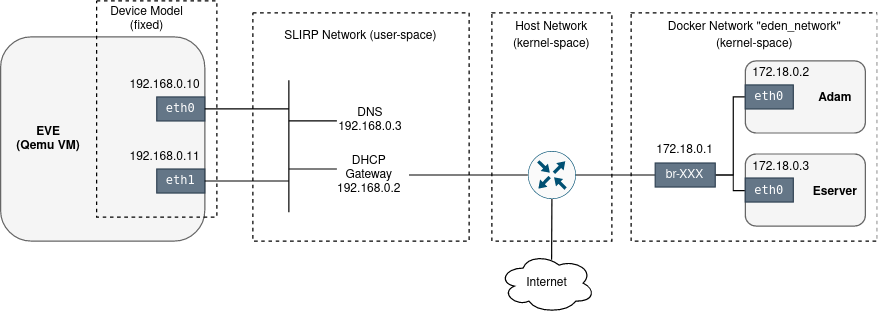
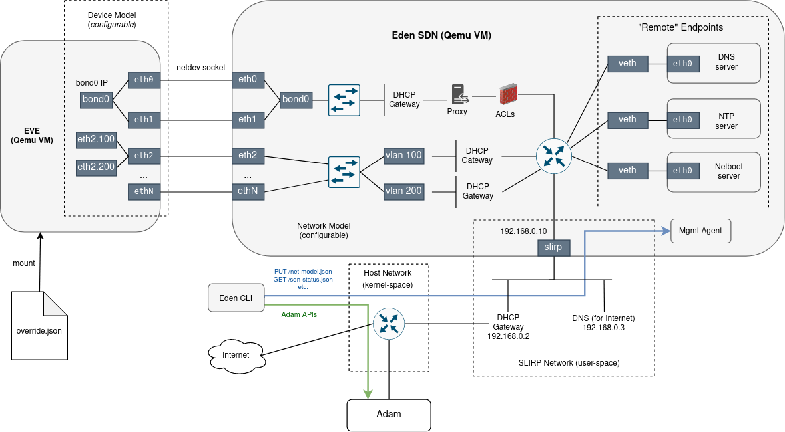

# Eden-SDN

## Motivation

Eden supports 3 virtualization technologies for running EVE inside a virtual device (VM): Qemu/KVM,
VirtualBox and Parallels.\
In terms of networking configured between EVE and other components of the eden infrastructure, there are
small differences between these 3 variants. However, in all cases the network configuration is mostly hard-coded:
EVE has 1 or 2 ethernet interfaces, DHCP is enabled for both interfaces and DHCP + DNS servers are provided
by the virtualization technology.

The Qemu/KVM variant is the most widely used and provides most configuration options. For example, apart
from two hard-coded ethernet interfaces (`eth0` and `eth1`) with enabled DHCP, it allows to create an
additional tap interface and let the user to manually configure bridging, routing and other aspects of
networking for this interface inside the host network (see [here](../docs/tap.md)). Interestingly
(or rather confusingly), `eth0` and `eth1` are put into the same segment. This is simply because there is
one test ([port_forward](../tests/eclient/testdata/port_forward.txt)) which needs this kind of topology to
exercise a specific use-case. In other words, one test from the entire test suite dictates what
the hard-coded network topology should be like.

Diagram below shows networking deployed by eden for EVE when QEMU/KVM is used (and Eden-SDN is disabled)
Note that IP addressing may differ in your case.



This approach is significantly limiting the scope of networking-related EVE features that can be covered
with eden. It is not possible to properly test the config bootstrapping (`bootstrap-config.pb`), network
config override (`override.json`, `usb.json`), static IP addressing, HTTP(S) proxies, different MTU
settings, VLANs, LAGs, network failures, etc. Even DNS and DHCP services as provided by the virtualization
technology allow only a very limited scope of customization. In the case of QEMU, eden is even using
user-space SLIRP network (to avoid requiring root privileges), which additionally limits the observability
and what can be done with the network (e.g. not possible to ping the device).

Moreover, traffic between EVE and Adam/Eserver is passing through and depends on the host network,
which is not ideal. It is preferred to have the testing infrastructure, including networking, more isolated
in order to avoid interference with the host.

Finally, to do at least some more advanced network testing with this current setup, we run network services
(like DHCP server) in some eden tests as EVE applications. The problem is that they require `NET_ADMIN`
capabilities. For security reasons, EVE does not grant these capabilities to native containers, therefore it
is required to deploy apps as VMs-in-Containers for these tests to pass. Without HW-assisted virtualization,
these tests must be therefore skipped. This is the case in github workflows. In other words, some eden tests
are not being run automatically by github for regression.

## Software-Defined Networking

The idea behind **Eden-SDN** is to make the networking deployed by eden fully **programmable** and also more
**isolated** from the host, allowing to exercise a much wider range of network-oriented tests and
experiments (without tampering with the host network).

Following the principles of the *Software-Defined Networking* (SDN for short), a desired state of the
network (interface count, topology, IP settings, firewall rules, etc.) is described declaratively and
applied into the network stack programmatically using a [management agent](./cmd/sdnagent).

We refer to this desired network state as "Network model". This is in resemblance to EVE terminology,
where "Device Model" is used to describe device hardware, including network adapters. In fact, Network
model affects Device model - for example it determines the number of ethernet interfaces a device
is going to have.

The network model is defined using Go language [here](./api/netModel.go). User prepares the content
of a network model as a JSON file and the same format is also used for transportation between
Eden and the SDN management agent.

## Components

Eden-SDN is a component of the eden infrastructure, running as an additional light-weight VM.
The VM is built inside the eden repository using linuxkit CLI during the `eden setup` stage.
It is deployed by `eden start` just before EVE VM. In terms of supported virtualization technologies,
the focus is on the Qemu/KVM variant. Others (Vbox, Parallels) are unsupported by the SDN for now.
With Qemu, the socket networking backend is used to create ethernet connections between EVE and SDN VMs.

The SDN VM runs a management agent, written in Go (see [here](./cmd/sdnagent)).
The main challenge for this agent is the reconciliation between the desired state (network model)
and the actual state of the (Linux) network stack. There is already a tool for this task inside
the EVE repository: [State Reconciler](https://github.com/lf-edge/eve/tree/master/libs/reconciler).

Eden-SDN depends on Linux network stack and the tools that it provides to build a desired network
topology (network namespaces, VETHs, Linux bridge, VLAN sub-interfaces, iptables, etc.). Additionally,
it uses [dnsmasq](https://thekelleys.org.uk/dnsmasq/doc.html) as a DNS and DHCP server,
and [goproxy library](https://github.com/elazarl/goproxy) to build a MITM or an explicit HTTP/HTTPS proxy.

By encapsulating all these aspects of networking into a VM, we get better isolation from the host.
However, adam controller still continues running as a container on the host inside the docker network.
And, of course, traffic headed toward the Internet also crosses the host network.

The agent runs an HTTP server and expose RESTful endpoints to apply/get network model, get status and more.
These endpoints are used by eden CLIs using a client implemented by package [edensdn](../pkg/edensdn).

For backward-compatibility (to ensure that existing eden tests will continue passing without
complete rewrite), eden will by default (i.e. if not specified) apply
the [default network model](../pkg/edensdn/netModel.go), which more or less corresponds to the static
network config used before Eden-SDN was introduced.

Diagram below shows an integration of the Eden-SDN VM with the rest of the eden infrastructure.
Note that the network topology displayed is only an example. In practise, it can be anything that
can be modeled by the network model.



## Configuration

The network model is configurable in the same way as the device model - using a configuration option
pointing to a JSON file:

```
eden config set $EDEN_CONFIG --key sdn.network-model --value <path>
eden config set $EDEN_CONFIG --key eve.devmodelfile --value <path>
```

Alternatively, it is possible to select the network model using a command line option for `eden start`:

```
eden start --sdn-network-model <path>
```

For now, the user is expected to prepare the network model manually as a JSON file.
We recommend to start from the provided [examples](./examples) (each has its own `network-model.json`).
Refer to the [underlying Go definition](./api/netModel.go) for in-line comments explaining all available 
model items and their parameters.

Apart from network model, there are several more configuration options available for Eden-SDN.
For example, it is possible to disable Eden-SDN completely with:

```
eden config set default --key sdn.disable --value true
```

Please refer to the in-line comments inside the section "sdn" of the [eden config](../docs/config.md)
to get a complete list of available options.

## Command-line Interface

A running Eden-SDN can be managed using `eden sdn` commands.

For example, to SSH into Eden-SDN VM run:

```
eden sdn ssh
```

Status of a running Eden-SDN can be displayed with:

```
eden sdn status
```

Network model can be changed in run-time as long as the number of EVE interfaces remains unchanged
(which would require restart of EVE and SDN VMs with different parameters):

```
eden sdn net-model apply <path>
```

Command `eden sdn fwd` requires a special attention. It is used to execute and port-forward
a given command aimed at a specific EVE interface and a port.
It can be used for example to access an HTTP server running as EVE app.
Note that you cannot run commands against EVE interfaces from the host directly - there is
Eden-SDN VM in the way. Even with SDN disabled (i.e. legacy mode with SLIRP networking on QEMU),
EVE interfaces and ports are not directly accessible from the host but must be port forwarded by QEMU.
You cannot therefore reference the target EVE IP address and port number directly, they could
be mapped to different values on the host (and forwarding may need to be established beforehand).
The command should therefore reference destination IP address and port number symbolically
with labels `FWD_IP` and `FWD_PORT`, and let Eden to establish forwarding, replace symbolic names
with an actual IP address and a port number, and run command from the host or from an SDN endpoint
(see `--from-ep` option).
For example (to SSH into `eclient` app deployed inside EVE and exposed on `eth0` on port `2222`):

```
eden sdn fwd eth0 2222 ssh -I ./dist/tests/eclient/image/cert/id_rsa root@FWD_IP FWD_PORT
```

Run `eden sdn` to get a full list of available commands.
